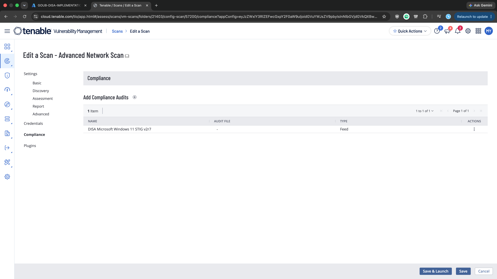
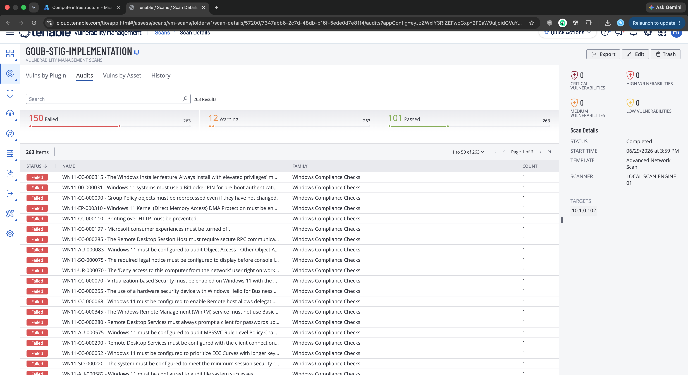
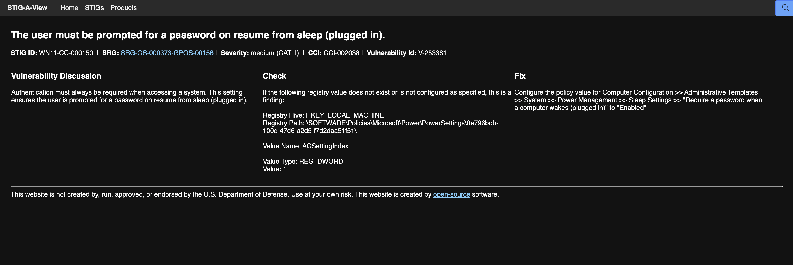
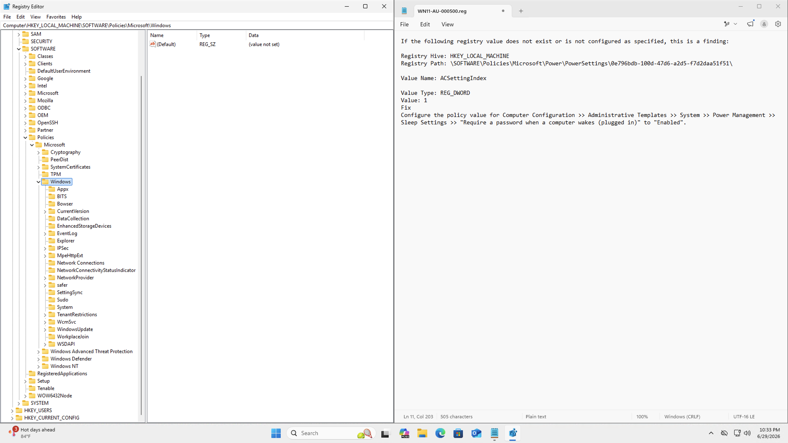
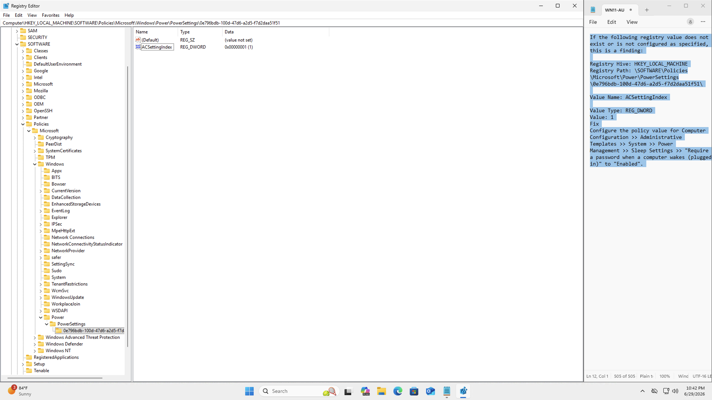
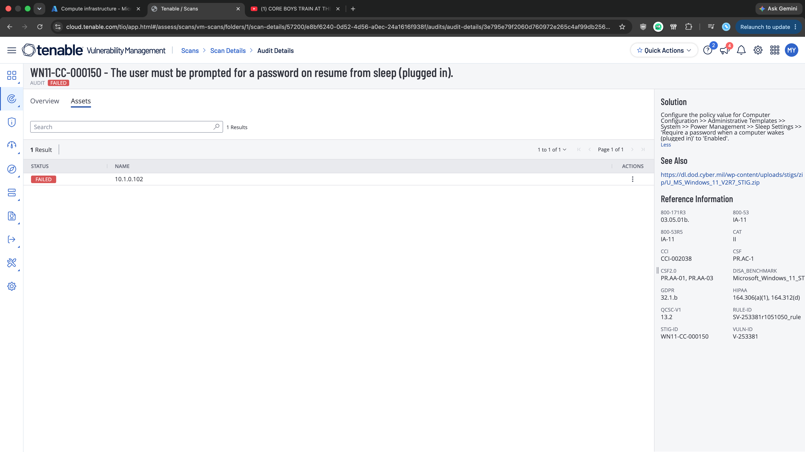
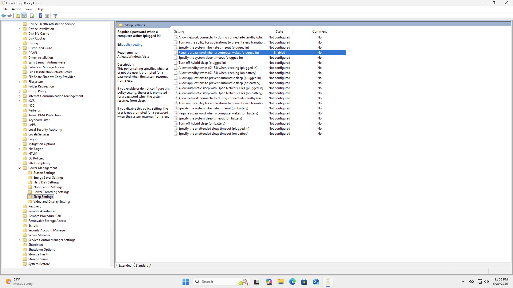
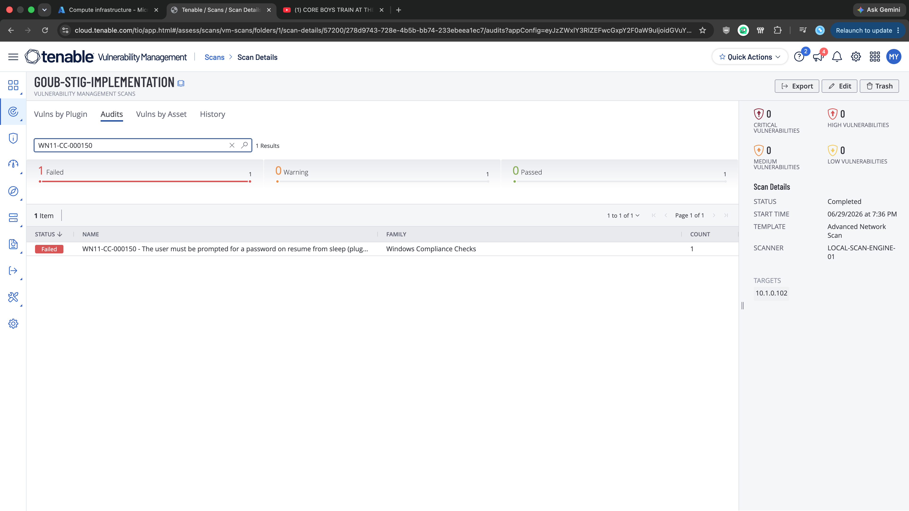
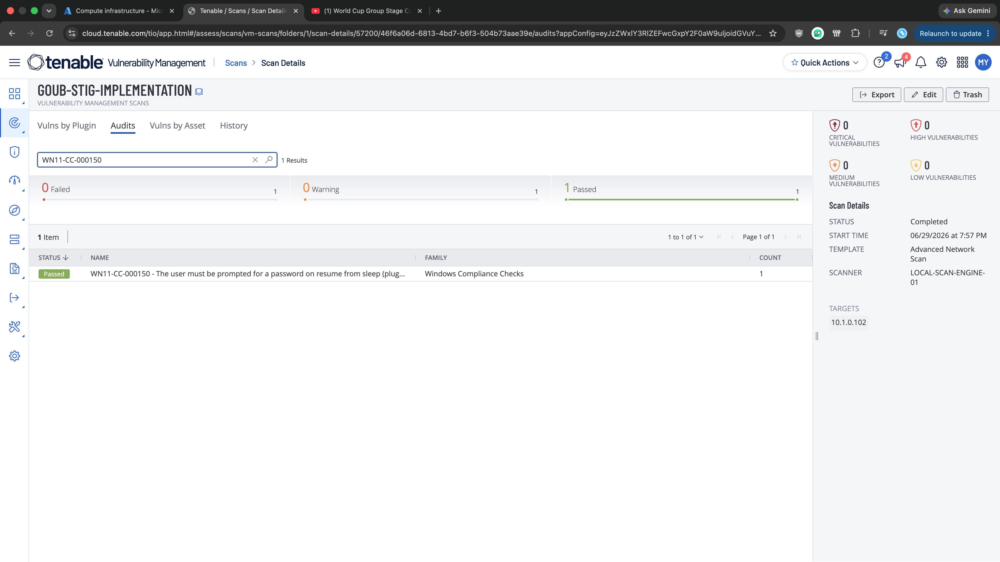

# Windows 11 STIG 02: V-253381 (WN11-CC-000150)

**Status:** Published
**STIG:** DISA Microsoft Windows 11 Security Technical Implementation Guide v2r7
**Finding:** V-253381 (WN11-CC-000150)

Part of the [DISA STIG Implementation with PowerShell](https://github.com/goubx/DISA-STIG-Implementation-w-PowerShell-series-) series.

---

## Overview

This entry hardens a stock Azure Windows 11 VM against one finding from the DISA Microsoft Windows 11 STIG v2r7 using PowerShell. The workflow:

1. Scan an unhardened Azure VM with Tenable's DISA STIG compliance audit.
2. Pick a failed finding from the Audit tab.
3. Remediate it manually to confirm the fix path.
4. Translate that fix into an idempotent PowerShell function.
5. Rescan to confirm the finding moves to passed.

This finding adds a real-world wrinkle: the first manual attempt didn't work because the registry path was created in the wrong subtree. The Group Policy approach surfaced the correct path, and that path is what the PowerShell script ultimately targets.

---

## Target Platform

| Field            | Value                          |
|------------------|--------------------------------|
| OS               | Windows 11 Pro                 |
| Azure VM         | Standard                       |
| Private IP       | 10.1.0.102                     |
| Domain joined    | No                             |

---

## Tools Used

| Tool                          | Purpose                                       |
|-------------------------------|-----------------------------------------------|
| Tenable Nessus                | Scanning with the DISA STIG audit             |
| Windows PowerShell ISE        | Remediation engine                            |
| Registry Editor (regedit)     | First manual attempt                          |
| Local Group Policy Editor     | Second manual attempt (succeeded)             |
| STIG-A-View                   | Finding reference and check details           |
| Azure                         | Lab VM hosting                                |

---

## Lab Setup

The lab uses a stock Azure Windows 11 VM with Windows Defender Firewall disabled so the Tenable scanner can reach the host across the lab network:


> Note: this is a lab-only step. In production you would scope firewall rules to permit the scan engine rather than disabling the firewall outright.

---

## Scan Configuration

The Tenable scan that produced this finding uses the Advanced Network Scan template, configured once and reused across all findings in this series:

1. **Scans → Create Scan → Advanced Network Scan**
2. Name: `GOUB-STIG-IMPLEMENTATION`
3. Target: the VM's private IP (`10.1.0.102`)
4. Scanner: internal scan engine
5. Credentials: local administrator on the VM

### Compliance audit

Under the Compliance tab, the DISA Microsoft Windows 11 STIG v2r7 audit is added:



### Plugin scoping

To keep the scan fast and focused on STIG findings only, every plugin family is disabled except one:

1. Plugins, filter for `policy`, enable **Policy Compliance**.
2. Inside Policy Compliance, enable only **Windows Compliance Checks** (Plugin ID 21156).


---

## Initial Scan

The initial scan against the stock Azure VM returned 150 failed audits out of 263 total checks. STIG findings on a default Windows 11 image are dense, which makes this a good source of remediation work:



The finding this repo documents:

> **WN11-CC-000150** : The user must be prompted for a password on resume from sleep (plugged in).

---

## Finding Details

Pulled from STIG-A-View:

| Field            | Value                          |
|------------------|--------------------------------|
| STIG ID          | WN11-CC-000150                 |
| Vulnerability ID | V-253381                       |
| Severity         | Medium (CAT II)                |
| CCI              | CCI-002038                     |
| SRG              | SRG-OS-000373-GPOS-00156       |



**Why it matters:** Authentication must always be required when accessing a system. Without this setting, anyone with physical access to a workstation that wakes from sleep can resume the session without a password.

**Fix per DISA:**
> Configure the policy value for Computer Configuration > Administrative Templates > System > Power Management > Sleep Settings > "Require a password when a computer wakes (plugged in)" to "Enabled".

Translated to the registry:

| Field         | Value                                                                          |
|---------------|--------------------------------------------------------------------------------|
| Hive          | HKEY_LOCAL_MACHINE                                                             |
| Path          | `\SOFTWARE\Policies\Microsoft\Power\PowerSettings\0e796bdb-100d-47d6-a2d5-f7d2daa51f51` |
| Value Name    | ACSettingIndex                                                                 |
| Value Type    | REG_DWORD                                                                      |
| Value Data    | 0x00000001 (1)                                                                 |

---

## Step 1: Manual Remediation

### First attempt: direct registry creation (failed)

The target registry path doesn't exist on a default Windows 11 install. I navigated to `HKEY_LOCAL_MACHINE\SOFTWARE\Policies\Microsoft\Windows` and confirmed no Power-related keys existed there:



I created the path and the `ACSettingIndex` DWORD value manually:



After restarting the VM and rerunning the Tenable scan, the finding was still failed:



**What went wrong:** look closely at the address bar in the screenshot above. The path I created was:

```
HKLM:\SOFTWARE\Policies\Microsoft\Windows\Power\PowerSettings\0e796bdb-100d-47d6-a2d5-f7d2daa51f51
```

The path the STIG actually checks is:

```
HKLM:\SOFTWARE\Policies\Microsoft\Power\PowerSettings\0e796bdb-100d-47d6-a2d5-f7d2daa51f51
```

The difference is one level: `Power` belongs as a direct child of `Microsoft`, not as a child of `Microsoft\Windows`. The value name and data were correct, but Tenable's compliance check looks at the exact path documented in the STIG, so it stayed failed.

### Second attempt: Group Policy (succeeded)

Rather than fix the path manually and risk getting the structure wrong again, I let Group Policy create the correct path for me. In Local Group Policy Editor:

> Computer Configuration > Administrative Templates > System > Power Management > Sleep Settings > "Require a password when a computer wakes (plugged in)" > Enabled



After restarting the VM and rerunning the scan, the finding passes:


The GPO change populated the correct registry path automatically. Now the script can target that exact path.

---

## Step 2: Capture the Registry Export

The correct registry state, as written by Group Policy, looks like:

```reg
Windows Registry Editor Version 5.00

[HKEY_LOCAL_MACHINE\SOFTWARE\Policies\Microsoft\Power\PowerSettings\0e796bdb-100d-47d6-a2d5-f7d2daa51f51]
"ACSettingIndex"=dword:00000001
```

That tells me what the PowerShell script needs to produce: the full path under `Microsoft\Power` (not `Microsoft\Windows\Power`), the value name `ACSettingIndex`, the type `REG_DWORD`, and the data `0x00000001`.

---

## Step 3: Revert and Re-verify

I reverted the Group Policy setting back to "Not Configured" and reran the scan. The finding is failed again, as expected:



Now there's a clean baseline to validate the script against.

---

## Step 4: PowerShell Remediation

```powershell
function Set-StigRule-V253381 {
    <#
    .SYNOPSIS
        V-253381: The user must be prompted for a password on resume from sleep (plugged in).

    .DESCRIPTION
        Severity:        CAT II (Medium)
        STIG ID:         WN11-CC-000150
        CCI:             CCI-002038
        Tenable Plugin:  Windows Compliance Checks (21156)
        Reference:       DISA Microsoft Windows 11 STIG v2r7

        Authentication must always be required when accessing a system. Sets
        ACSettingIndex to 1 under the Power\PowerSettings policy key, which
        is the registry change Group Policy makes when enabling
        "Require a password when a computer wakes (plugged in)".

    .EXAMPLE
        Set-StigRule-V253381
    #>
    [CmdletBinding(SupportsShouldProcess)]
    param()

    $RegPath = 'HKLM:\SOFTWARE\Policies\Microsoft\Power\PowerSettings\0e796bdb-100d-47d6-a2d5-f7d2daa51f51'
    $Name    = 'ACSettingIndex'
    $Desired = 1   # 1 = Enabled (password required on wake while plugged in)

    # Create the registry path if it does not exist
    if (-not (Test-Path $RegPath)) {
        New-Item -Path $RegPath -Force | Out-Null
        Write-Host "Created registry path: $RegPath"
    }

    # Apply the ACSettingIndex value
    Set-ItemProperty -Path $RegPath -Name $Name -Value $Desired -Type DWord -Force
    Write-Host "Set $Name to $Desired in $RegPath"

    # Verify
    $Current = (Get-ItemProperty -Path $RegPath -Name $Name).$Name
    if ($Current -eq $Desired) {
        Write-Host "Compliant: $Name = $Current"
    } else {
        Write-Warning "Non-compliant: $Name = $Current, expected $Desired"
    }
}
```

What it does, in order:

1. **Check path.** `Test-Path` confirms whether the Power\PowerSettings policy key exists at the correct location under `Microsoft\Power`.
2. **Create if missing.** `New-Item -Force` creates the key and all missing parents in one call.
3. **Set the value.** `Set-ItemProperty` writes `ACSettingIndex` as a DWord with the desired data (1).
4. **Verify.** Reads the value back and emits a clear Compliant or Non-compliant line.

Expected output when run from an elevated PowerShell ISE session against the reverted baseline:

```
Created registry path: HKLM:\SOFTWARE\Policies\Microsoft\Power\PowerSettings\0e796bdb-100d-47d6-a2d5-f7d2daa51f51
Set ACSettingIndex to 1 in HKLM:\SOFTWARE\Policies\Microsoft\Power\PowerSettings\0e796bdb-100d-47d6-a2d5-f7d2daa51f51
Compliant: ACSettingIndex = 1
```

---

## Step 5: Final Validation

After restarting the VM and rerunning the same Tenable scan, the finding passes:



---

## Result

| Stage                                | WN11-CC-000150 |
|--------------------------------------|----------------|
| Initial scan                         | Failed         |
| After first manual attempt (wrong path) | Failed      |
| After Group Policy fix               | Passed         |
| After reverting                      | Failed         |
| After PowerShell remediation         | Passed         |

The finding was cleared via Group Policy and programmatically, with the scan-pass state proven against a clean baseline both times.

---

## Notes

### Operational impact
Users on the target VM will be prompted for credentials when waking the machine from sleep while plugged into AC power. Expected behavior for any secured workstation. No services restarted, no follow-up action required.

### Lesson learned: STIG registry paths are exact
The first attempt created the registry value at `Microsoft\Windows\Power\PowerSettings\...` instead of `Microsoft\Power\PowerSettings\...`. The data was correct but the path was wrong by one level, and the compliance check failed.

Two takeaways:

1. **Read the registry path from the STIG character by character before manually creating keys.** It's easy to assume a Windows-related policy lives under `Microsoft\Windows`, but power policies live directly under `Microsoft\Power`. Tenable's STIG audit checks the literal path documented in the rule.
2. **Group Policy is a useful diagnostic tool.** When in doubt about the exact registry layout a policy produces, enable the corresponding GPO and inspect the registry afterward. That's the ground truth for what the script needs to write.

---

## References

- [DISA STIG Library](https://public.cyber.mil/stigs/)
- [STIG-A-View entry for V-253381](https://www.stigaview.com/products/windows-11/v2r7/V-253381/)
- [Tenable Plugin Database](https://www.tenable.com/plugins/search)
